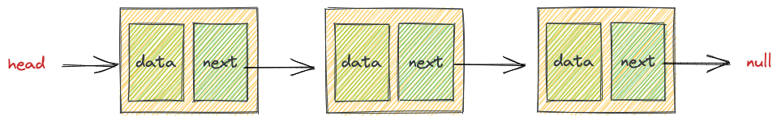

# 链表

## 基础

链表能够指向内存中不连续的空间

## 单链表

线性的数据结构

### 一. 合并两个有序链表

1. [【21】合并两个有序链表](https://leetcode.cn/problems/merge-two-sorted-lists/)

2. 链表的分解
3. 合并k个有有序链表
4. 寻找单链表的倒数第k个节点
5. 寻找单链表的中点
6. 判断单链表是否包含环并找出环起点
7. 判断两个单链表是否相交并找出交点

## 双向链表

## 单向循环链表

## 双向循环链表

## 环形链表