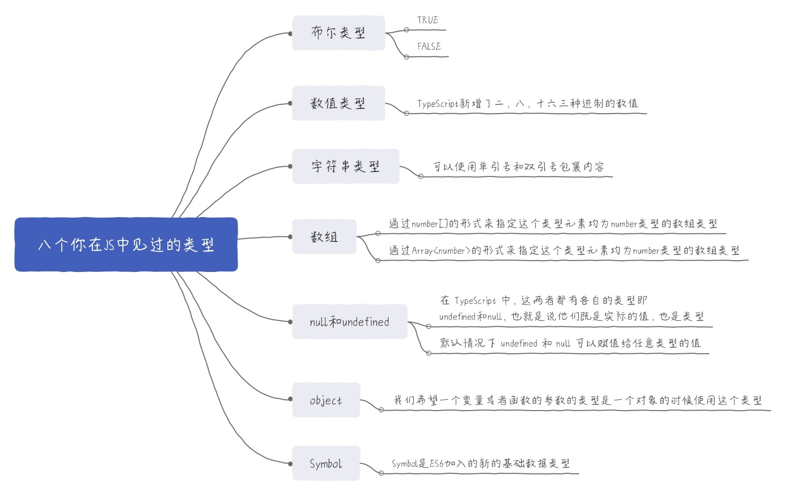
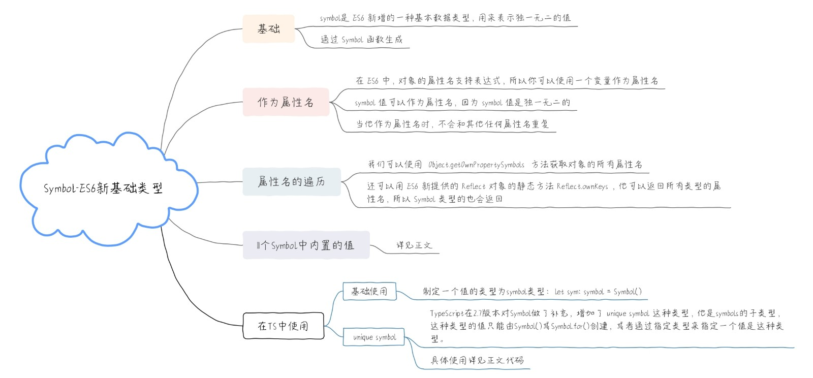
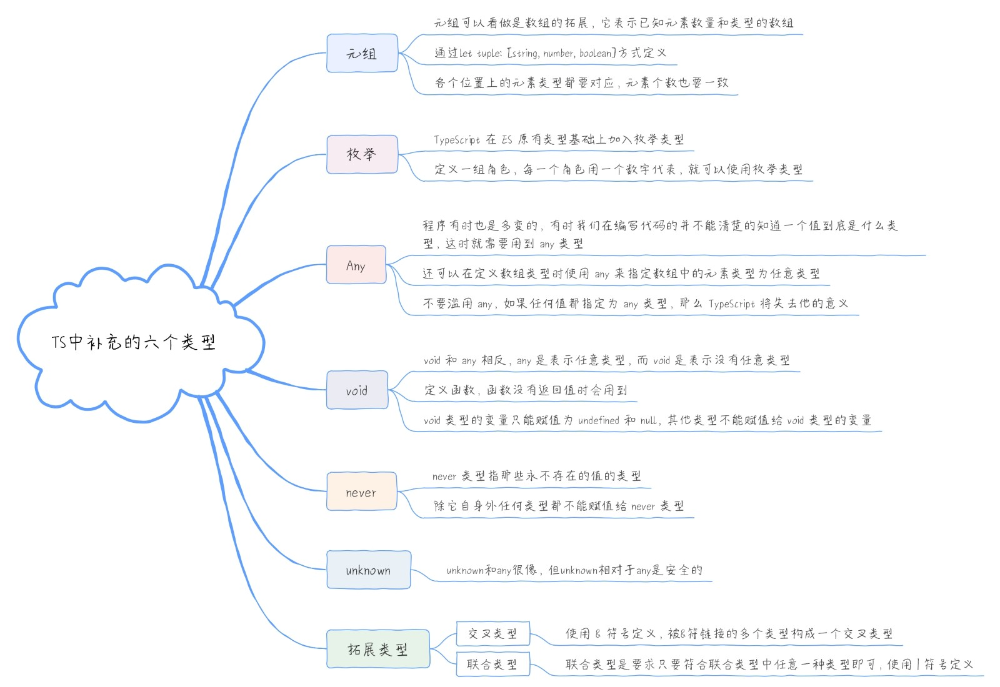

## JS基础类型

- 布尔类型：boolean
- 数值类型：number
- 字符串类型：string
- 数组：Array<type>或type[]
- 对象类型：object
- Symbol类型：symbol
- null和undefined：null 和 undefined，这个比较特殊，它们自身即是类型
- BigInt类型： bigint




### number

```tsx
const decLiteral: number = 1
const hexLiteral: number = 0xf00d
const binaryLiteral: number = 0b1010
const octalLiteral: number = 0o744
```


### string

```tsx
const strData: string = 'qietuniu'
```


### boolean

```tsx
const boolData = true
```


### null 和 undefined

```tsx
let a: undefined = undefined;
let b: null = null;
```


## array

```tsx
const arrData: Array<number> = [1, 2, 3]
const arrData: number[] = [1, 2, 3]
const arrData = [1, 2, 3, 4]
```


### object

普通对象、枚举、数组、元组通通都是 object 类型。

```tsx
const arrData: Array<number> = [1, 2, 3]
const arrData: number[] = [1, 2, 3]
const arrData = [1, 2, 3, 4]
```

给object 类型的对象赋值，后面通过属性访问操作符访问这个对象的某个属性，会报错

```tsx
let obj: object
obj = { name: 'Lison' }
console.log(obj.name) // error 类型“object”上不存在属性“name”

function getKeys (obj: object) {
    return Object.keys(obj) // 会以列表的形式返回obj中的值
}
getKeys({ a: 'a' }) // ['a']
getKeys(123) // error 类型“123”的参数不能赋给类型“object”的参数
```


### Symbol



Symbol 前面不能加`new`关键字，直接调用即可创建一个独一无二的 symbol 类型的值。

```tsx
const sym1 = Symbol('key1');
const sym2 = Symbol('key2');

Symbol('key1') === Symbol('key1') // false

console.log(sym1.toString()); // 'Symbol('key1')'
```

TypeScript在2.7版本对Symbol做了补充，增加了**unique symbol**这种类型，他是symbols的子类型，这种类型的值只能由Symbol()或Symbol.for()创建，或者通过指定类型来指定一个值是这种类型定义unique symbol类型的值，必须用const不能用let。

```tsx
const key1: unique symbol = Symbol()
let key2: symbol = Symbol()
const obj = {
    [key1]: 'value1',
    [key2]: 'value2'
}
console.log(obj[key1])
console.log(obj[key2]) // error 类型“symbol”不能作为索引类型使用。
```

#### 属性名

```tsx
let name = Symbol();
let obj = {
  [name]: "qietuniu"
};
console.log(obj); // { Symbol(): 'qietuniu' }
console.log(obj[name]); // 'qietuniu'
console.log(obj.name); // undefined
```

#### 属性名遍历

使用 Symbol 类型值作为属性名，这个属性不会被`for…in`遍历到，也不会被`Object.keys()`、`Object.getOwnPropertyNames()`、`JSON.stringify()`获取到。

- `Object.getOwnPropertySymbols`方法获取对象的所有symbol类型的属性名
- `Reflect.ownKeys`方法它可以返回所有类型的属性名

```tsx
const name = Symbol("name");
const obj = {
  [name]: "qietuniu",
  age: 18
};
for (const key in obj) {
  console.log(key);
}
// => 'age'
console.log(Object.keys(obj));
// ['age']
console.log(Object.getOwnPropertyNames(obj));
// ['age']
console.log(JSON.stringify(obj));
// '{ "age": 18 }'

// `Object.getOwnPropertySymbols`
const SymbolPropNames = Object.getOwnPropertySymbols(obj);
console.log(SymbolPropNames);// [ Symbol(name) ]
console.log(obj[SymbolPropNames[0]]);// 'qietuniu'

// `Reflect.ownKeys`
console.log(Reflect.ownKeys(obj)); // [ 'age', Symbol(name) ]
```

#### Symbol.for()和 Symbol.keyFor()

Symbol.for()方法传入字符串，会先检查有没有使用该字符串调用 Symbol.for 方法创建的 symbol 值，如果有，返回该值，如果没有，则使用该字符串新创建一个。**使用该方法创建 symbol 值后会在全局范围进行注册，注册的范围包括当前页面和页面中包含的 iframe，以及 service sorker。

```tsx
const s3 = Symbol.for("qietuniu");
const s4 = Symbol.for("qietuniu");
s3 === s4; // true
const iframe = document.createElement("iframe");
iframe.src = String(window.location);
document.body.appendChild(iframe);

iframe.contentWindow.Symbol.for("lison") === Symbol.for("lison"); // true
```

Symbol.keyFor()该方法传入一个 symbol 值，返回该值在全局注册的键名

```tsx
const sym = Symbol.for("qietuniu");
console.log(Symbol.keyFor(sym)); // 'qietuniu'
```

#### 内置symbol值

1、Symbol.hasInstance

当你给一个对象设置以 Symbol.hasInstance 为属性名的方法后，当其他对象使用 instanceof 判断是否为这个对象的实例时，会调用你定义的这个方法，参数是其他的这个对象

```js
const obj = {
  [Symbol.hasInstance](otherObj) {
    console.log(otherObj);
  }
};
console.log({ a: "a" } instanceof obj); // false
// 注意：在TypeScript中这会报错，"instanceof" 表达式的右侧必须属于类型 "any"，或属于可分配给 "Function" 接口类型的类型。
// 是要求你instanceof操作符右侧的值只能是构造函数或者类，或者类型是any类型。这里你可以使用类型断言，将obj改为obj as any
```

2、Symbol.isConcatSpreadable

这个值是一个可读写布尔值，其值默认是undefined，当一个数组的 Symbol.isConcatSpreadable 设为 true或者为默认的undefined 时，这个数组在数组的 concat 方法中会被扁平化

```js
let arr = [1, 2];
console.log([].concat(arr, [3, 4])); // 打印结果为[1, 2, 3, 4]，length为4
let arr1 = ["a", "b"];
console.log(arr1[Symbol.isConcatSpreadable]); // undefined
arr1[Symbol.isConcatSpreadable] = false;
console.log(arr1[Symbol.isConcatSpreadable]); // false
console.log([].concat(arr1, [3, 4])); // 打印结果如下：
/*
 [ ["a", "b", Symbol(Symbol.isConcatSpreadable): false], 3, 4 ]
 最外层这个数组有三个元素，第一个是一个数组，因为我们设置了arr1[Symbol.isConcatSpreadable] = false
 所以第一个这个数组没有被扁平化，第一个元素这个数组看似是有三个元素，但你在控制台可以看到这个数组的length为2
 Symbol(Symbol.isConcatSpreadable): false不是他的元素，而是他的属性，我们知道数组也是对象，所以我们可以给数组设置属性
 你可以试试如下代码，然后看下打印出来的效果：
  let arr = [1, 2]
  arr.props = 'value'
  console.log(arr)
 */
```

3、Symbol.species

当你给一个对象设置以 Symbol.hasInstance 为属性名的方法后，当其他对象使用 instanceof 判断是否为这个对象的实例时，会调用你定义的这个方法，参数是其他的这个对象

```js
// 只让衍生的数组是 Array 的实例：给类 C 定义一个静态 get 存取器方法，方法名为 Symbol.species，然后在这个方法中返回要构造衍生数组的构造函数
class C extends Array {
  static get [Symbol.species]() {
    return Array;
  }
  getName() {
    return "lison";
  }
}
const c = new C(1, 2, 3);
const a = c.map(item => item + 1);
console.log(a); // [2, 3, 4]
console.log(a instanceof C); // false
console.log(a instanceof Array); // true
console.log(a.getName()); // error a.getName is not a function
```

4、Symbol.match、Symbol.replace、Symbol.search 和 Symbol.split

Symbol.match 值指向一个内部方法，当在字符串 str 上调用 match 方法时，会调用这个方法，其他用法类似

```js
let obj = {
  [Symbol.match](string) {
    return string.length;
  }
};
console.log("abcde".match(obj)); // 5
```

5、Symbol.iterator

数组的 Symbol.iterator 属性指向该数组的默认遍历器方法

```js
const arr = [1, 2, 3];
const iterator = arr[Symbol.iterator]();
console.log(iterator);
console.log(iterator.next());
console.log(iterator.next());
console.log(iterator.next());
console.log(iterator.next());
```

6、Symbol.toPrimitive

对象的这个属性指向一个方法，当这个对象被转为原始类型值时会调用这个方法，这个方法有一个参数，是这个对象被转为的类型

```js
let obj = {
  [Symbol.toPrimitive](type) {
    console.log(type);
  }
};
// const b = obj++ // number
const a = `abc${obj}`; // string
```

7、Symbol.toStringTag

Symbol.toStringTag 和 Symbol.toPrimitive 相似，对象的这个属性的值可以是一个字符串，也可以是一个存取器 get 方法，当在对象上调用 toString 方法时调用这个方法，返回值将作为"[object xxx]"中 xxx 这个值

```js
let obj = {
  [Symbol.toStringTag]: "lison"
};
obj.toString(); // "[object lison]"
let obj2 = {
  get [Symbol.toStringTag]() {
    return "haha";
  }
};
obj2.toString(); // "[object haha]"
```

8、Symbol.unscopables

使用 with 传入一个对象后，在代码块中访问对象的属性就不需要写对象了，直接就可以用它的属性。对象的 Symbol.unscopables 属性指向一个对象，该对象包含了当使用 with 关键字时，哪些属性被 with 环境过滤掉

```js
const obj = {
  a: "a",
  b: "b"
};
with (obj) {
  console.log(a); // "a"
  console.log(b); // "b"
}
// 如果是在TypeScript开发环境中，这段代码可能with会报错：不支持 "with" 语句，这是因为在严格模式下，是不允许使用with的

console.log(Array.prototype[Symbol.unscopables]);
/*
{
    copyWithin: true
    entries: true
    fill: true
    find: true
    findIndex: true
    includes: true
    keys: true
    values: true
}
*/
```

#### 配置

使用 symbol需要在 tsconfig.json 里添加 es6 编译辅助库:

```js
// "lib": ["es6", "dom"]
const sym: symbol = Symbol('key');
```


### BigInt

使用 `BigInt` s需要在 tsconfig.json 里添加添加 `ESNext` 的编译辅助库

```tsx
const bigNumber: bigint = BigInt(Number.MAX_SAFE_INTEGER);
```

得注意的是我们需要用 `BigInt(number)` 把 Number 转化为 `BigInt`,同时如果类型是 `BigInt` ,那么数字后面需要加 `n` ,就如同上面例子的 `const max1 = max + 1n` 中的 `1n`。

```tsx
const max = Number.MAX_SAFE_INTEGER;

const max1 = max + 1
const max2 = max + 2

max1 === max2 //true

const max = BigInt(Number.MAX_SAFE_INTEGER);

const max1 = max + 1n
const max2 = max + 2n

max1 === max2 // false
```


## TS补充类型

- 元组类型Tuple
- any
- unknown
- void
- never
- 枚举



### 元组

元组可以看做是数组的拓展，它表示已知各个位置元素类型的数组。

```tsx
let tuple: [string, number, boolean];
tuple = ["a", 2, false];
tuple = [2, "a", false]; // error,个数和类型不同都会报错
```

2.6 之后的版本，去掉了这个**越界元素是联合类型的子类型即可**的条件，要求元组赋值必须类型和个数都对应。

```tsx
// 2.6-
interface Tuple extends Array<number | string> {
  0: string;
  1: number;
}
// 2.6+
interface Tuple extends Array<number | string> {
  0: string;
  1: number;
  length: 2;
}
```


### any

不清楚类型的变量指定一个类型

```tsx
let notSure: any = 4;
notSure = "maybe a string instead";
```


### unknown

 `unknown` 与 `any` 的不同之处,虽然它们都可以是任何类型,但是当 `unknown` 类型被确定是某个类型之前, 它不能被进行任何操作比如实例化、getter、函数执行等等，这也是为什么说 `unknown` 是更安全的 `any`, `any` 由于过于灵活的设定,导致它与 JavaScript 没有太多区别,很容易产生低级错误,很多场景下我们可以选择 `unknown` 作为更好的替代品

```tsx
let value: any;

value.foo.bar;  // OK
value();        // OK
new value();    // OK
value[0][1];    // OK

let value: unknown;

value.foo.bar;  // ERROR
value();        // ERROR
new value();    // ERROR
value[0][1];    // ERROR

```

类型保护可以缩小类型范围

```tsx
function getValue(value: unknown): string {
  // 这里由于把value的类型缩小为Date实例的范围内
  if (value instanceof Date) { 
    return value.toISOString();
  }
  return String(value);
}
```


### void

void 和 any 相反，any 是表示任意类型，而 void 是表示没有任意类型.函数没有返回值时其返回值类型是 void, 只有`null`和`undefined`可以赋给`void`

```tsx
function warnUser(): void {
    alert("This is my warning message");
}
const a: void = undefined

```


### never

那些永不存在的值的类型。

- 总会抛出异常或根本不会有返回值的函数表达式的返回值类型
- 当变量被永不为真的类型保护

```tsx
// 抛出异常的函数永远不会有返回值
const errorFunc = (message: string): never => {
  throw new Error(message);
};
// 除它自身外任何类型都不能赋值给 never 类型
let neverVariable = (() => {
  while (true) {}
})();
neverVariable = 123; // error 不能将类型"number"分配给类型"never"
```


### 枚举

枚举类型用 `enum` 关键字定义，用于声明一组命名的常数, 当一个变量有几种可能的取值时,可以将它定义为枚举类型。


#### 数字枚举

- 默认从0开始依次累加。

- 可以修改起始数据
- 指定任意字段的索引值
- 指定部分字段，其他使用默认递增索引

```tsx
// 这里你的TSLint可能会报一个：枚举声明只能与命名空间或其他枚举声明合并。这样的错误，这个不影响编译，声明合并的问题我们在后面的小节会讲。
enum Status {
  Uploading,
  Success,
  Failed
}
console.log(Status.Uploading); // 0
console.log(Status["Success"]); // 1
console.log(Status.Failed); // 2
```

**数字枚举**在定义值的时候，可以使用计算值和常量。但是要注意，如果某个字段使用了计算值或常量，那么该字段后面紧接着的字段必须设置初始值，这里不能使用默认的递增值

```tsx
const getValue = () => {
  return 0;
};
enum ErrorIndex {
  a = getValue(),
  b, // error 枚举成员必须具有初始化的值
  c
}
enum RightIndex {
  a = getValue(),
  b = 1,
  c
}
const Start = 1;
enum Index {
  a = Start,
  b, // error 枚举成员必须具有初始化的值
  c
}
```

#### 字符串枚举

字符串枚举值要求每个字段的值都必须是字符串字面量，或者是该枚举值中另一个字符串枚举成员。

```tsx
enum Message {
  Error = "error message",
  ServerError = Error,
  ClientError = Error
}
console.log(Message.Error); // 'error message'
console.log(Message.ServerError); // 'error message'
```

#### 异构枚举

异构枚举就是枚举值中成员值既有数字类型又有字符串类型，尽量避免使用异构枚举。

```tsx
enum Result {
  Faild = 0,
  Success = "Success"
}
```

#### 反向映射

反向映射只支持数字枚举。

```tsx
enum Direction {
    Up = 10,
    Down,
    Left,
    Right
}

console.log(Direction[10], Direction['Right']); // Up 13
```

因为 `Direction[Direction["Up"] = 10] = "Up"` 也就是 `Direction[10] = "Up"` ,所以我们可以把枚举类型看成一个JavaScript对象，而由于其特殊的构造，导致其拥有正反向同时映射的特性

```tsx
var Direction;
(function (Direction) {
    Direction[Direction["Up"] = 10] = "Up";
    Direction[Direction["Down"] = 11] = "Down";
    Direction[Direction["Left"] = 12] = "Left";
    Direction[Direction["Right"] = 13] = "Right";
})(Direction || (Direction = {}));
```

#### 枚举成员类型和联合枚举类型

如果枚举值里所有成员的值都是字面量类型的值，那么这个枚举的每个成员和枚举值本身都可以作为类型来使用。

- 不带初始值的枚举成员，例如`enum E { A }`
- 值为字符串字面量，例如`enum E { A = ‘a’ }`
- 值为数值字面量，或者带有`-`符号的数值字面量，例如`enum E { A = 1 }`、`enum E { A = -1 }`

```tsx
enum Animal {
  Dog = 1,
  Cat = 2
}
interface Dog {
  type: Animal.Dog; // 这里使用Animal.Dog作为类型，指定接口Dog的必须有一个type字段，且类型为Animal.Dog
}
interface Cat {
  type: Animal.Cat; // 这里同上
}
let cat1: Cat = {
  type: Animal.Dog // error [ts] 不能将类型“Animal.Dog”分配给类型“Animal.Cat”
};
let dog: Dog = {
  type: Animal.Dog
};
```

定义接口 Light 的 status 字段的类型为枚举值 Status，那么此时 status 的属性值必须为 Status.Off 和 Status.On 中的一个，也就是相当于`status: Status.Off | Status.On`

```tsx
enum Status {
  Off,
  On
}
interface Light {
  status: Status;
}
enum Animal {
  Dog = 1,
  Cat = 2
}
const light1: Light = {
  status: Animal.Dog // error 不能将类型“Animal.Dog”分配给类型“Status”
};
const light2: Light = {
  status: Status.Off
};
const light3: Light = {
  status: Status.On
};
```

#### 运行时的枚举

枚举在编译成 JavaScript 之后实际是一个对象，可当成对象来使用。

```tsx
enum E {
  A,
  B
}
const getIndex = (enumObj: { A: number }): number => {
  return enumObj.A;
};
console.log(getIndex(E)); // 0
```

```tsx
{
    0: "A",
    1: "B",
    A: 0,
    B: 1
}
```

#### const enum

定义枚举的语句之前加上`const`关键字，这样编译后的代码不会创建这个对象，只是会从枚举里拿到相应的值进行替换。

```tsx
enum Status {
  Off,
  On
}
const enum Animal {
  Dog,
  Cat
}
const status = Status.On;
const animal = Animal.Dog;
```

```tsx
var Status;
(function(Status) {
  Status[(Status["Off"] = 0)] = "Off";
  Status[(Status["On"] = 1)] = "On";
})(Status || (Status = {}));
var status = Status.On;
var animal = 0; /* Dog */
```

